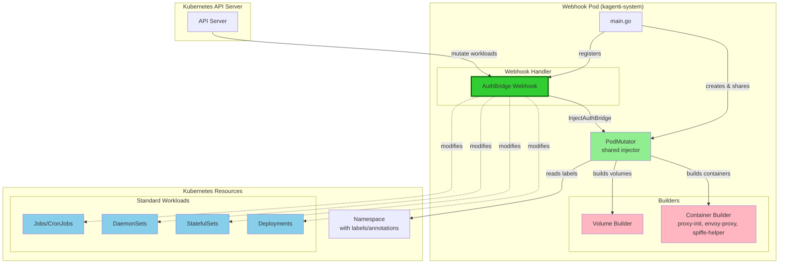
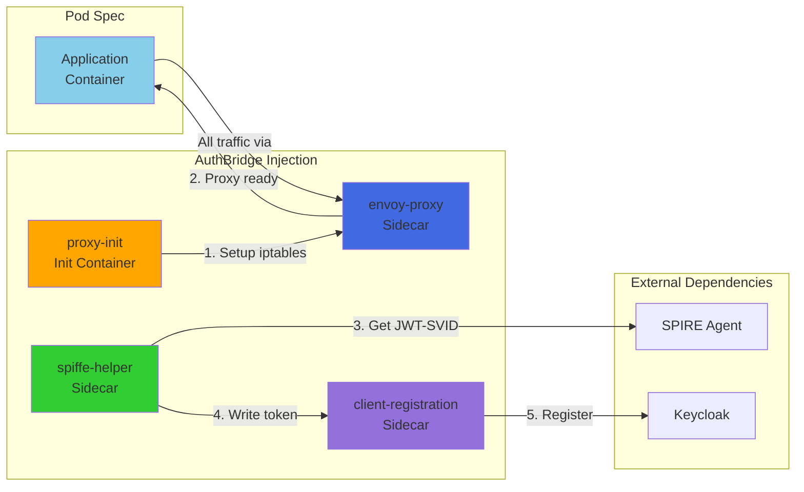
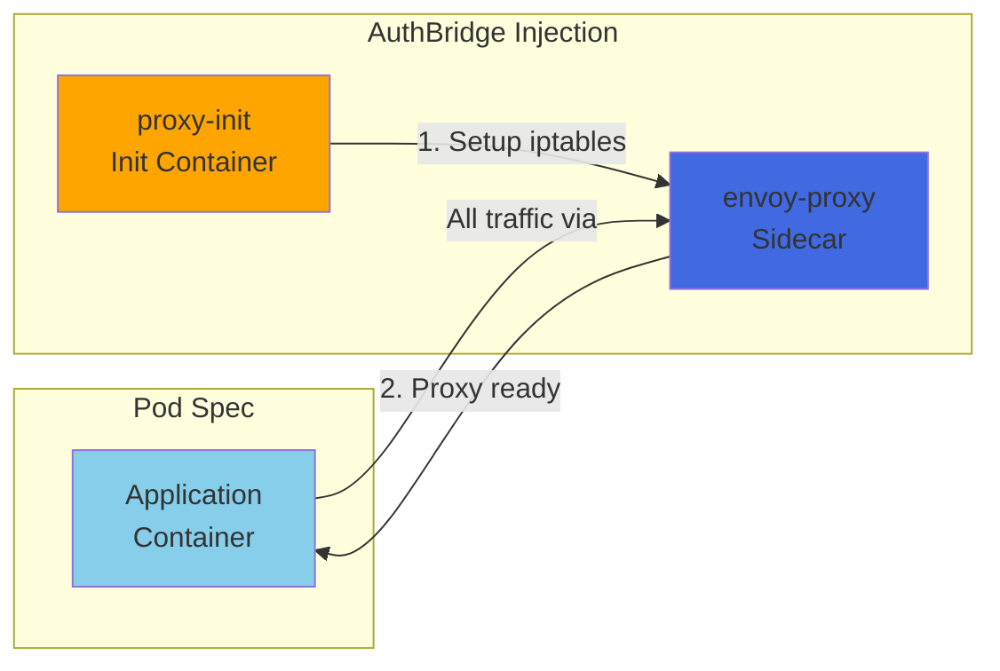
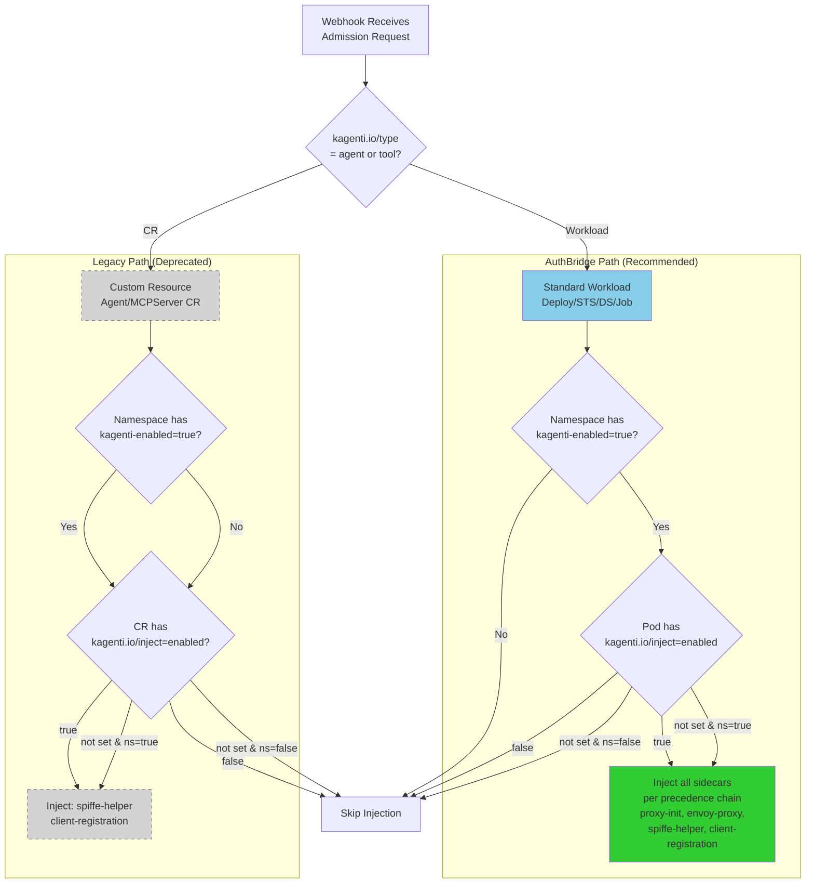

# Kagenti Webhook Architecture

This document provides Mermaid diagrams illustrating the webhook architecture.

## Component Architecture



## Container Injection Flow

### With SPIRE Integration

When `kagenti.io/spire: enabled` label is set on the pod template:



### Without SPIRE Integration

When `kagenti.io/spire` label is **not** set (default):



## Injection Decision Flow



## Key Differences

| Aspect | AuthBridge (Recommended) | Legacy (Deprecated) |
|--------|--------------------------|---------------------|
| **Resources** | Standard K8s workloads | Custom Resources |
| **Injection Control** | Pod labels | CR annotations |
| **SPIRE** | Injected by default; opt out via `kagenti.io/spire: disabled` | Always enabled |
| **Containers** | Init: proxy-init<br/>Sidecars: envoy-proxy, spiffe-helper, client-registration | Sidecars: spiffe-helper, client-registration |
| **Traffic Management** | ✅ Envoy proxy with iptables | ❌ No proxy |
| **Authentication** | Multiple methods (SPIRE, mTLS, JWT, etc.) | SPIRE only |
| **Method** | `InjectAuthBridge()` | `MutatePodSpec()` |

spiffe-helper is injected by default; set `kagenti.io/spire: disabled` on the pod template to opt out.
```
